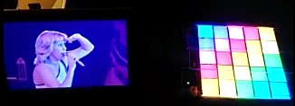

# Introduction

## Acknowledgment

This project startet of as a birthday gift for a good friend. He is fond of colorful
blinking lights. As he called for a 70s disco birthay party, the idea for this project
was born.

> Dedicated to Howy. Happy birthday to your 0x28th birthday.

## What's is this

The dance floor is a ca. 20 x 20 cm flat box with 25 full color RGB LEDs. It is controlled
by an [Arduino] Uno microcontroller board. Programing the controller so the lights
light up in a useful manner is all the fun of the project. For now it can play
sequences of frames that change to the rhythm of music or at a adjustable bpm
(beats per minute) rate.

# Usage

At startup a fixed welcome text is played. It can be skipped by pressing the *PROG*
button.

## Swithing programs

A program is usually a sequence of frames that repeats over and over. You can
toggle programs by pressing the *PROG* button.

## Random program change

A long press on the *PROG* button will switch to random mode.
The program will change automatically after a random amount of seconds between
1 and 20. The time is normal distributed. The next program is also choosen
randomly (welcome program excluded).

Another press of the *PROG* button will leave the random mode with the last program
staying active.

## Sound to light mode
Pressing th *MODE* button will switch between _Sound to light_ and _Beats per minute_ mode.
_Sound to light_ mode is active then the control LED is on.
In this mode, the build in microphone will trigger the frame change, when a certain
volumn is exceeded. The maximum possible rate of frame changes is cut of at 300 bpm.

> In this hardware release the sensitivity can only be adjusted by a small extra poti.
To adjust the sensitivity, change the volumn of the music or move the dance floor
away from it (especially the microphone).

## BPM mode
Pressing th *MODE* button will switch between _Sound to light- and _Beats per minute_ mode.
_Beats per minute_ mode is active then the control LED is off.

In this mode A poti to adjust the speed in normal mode (or sensitivity in Sount-to-Light mode).

# Implementation

## Code tour

### Config.h

### DanceFloor.ino

### Controller

### FrameRenderer

### Player.h

### PaletteSequencePlayer
This player can play sequences that are stored as frames of indexes into a
palette array that stores the used colors.

### programs.h

## Palette sequences
There is a side project for designing the sequences that can be found [here][Sequencer].
It stores the sequences as a JSON file.
The SequencePalletizer tool parses these files and generates a header file with
a palette and sequence C array from it. A powershell script does this for all
sequences in the _Sequences_ folder. The header files must then only be incorporated
in the _progams.h_.

## Backlog

### Frame Interpolation
Helper function to interpolate between two frames (Crossfade).
A sequence program must opt in for this.

### Sound-to-Light sensitivity

This is not supported in the current hardware version.

### MISC
LED (Blue) and button for future extension...

# License

The DanceFloor project is released under the [MIT License][opensource].

# Credits

[Adafruit WS2801 Library on GitHub][WS2801 Lib]

[Floating Point Autoscale Function by Paul Badger][fscale]

[Plasma code by bidouille][Plasma]

[Gaussian distribution class by Ivan Seidel Gomes][Gaussian]

[Sequencer]: https://github.com/angus42/dancefloor-sequencer
[Arduino Due]: http://www.arduino.cc/
[fscale]: http://playground.arduino.cc/Main/Fscale
[WS2801 Lib]: https://github.com/adafruit/Adafruit-WS2801-Library
[Plasma]: http://www.bidouille.org/prog/plasma
[Gaussian]: https://github.com/ivanseidel/Gaussian
[opensource]: http://www.opensource.org/licenses/MIT
